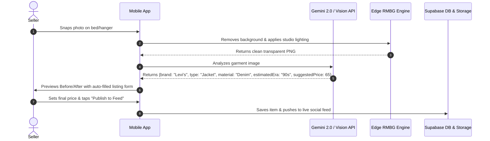

# 🏷️ Cloey Thrift: AI-Powered Social Marketplace Design System

**Project Vision:** Transform casual thrift selling into an editorial luxury shopping experience. Sellers upload raw, casual photos of clothes taken on their bed or hanger, and on-device/cloud AI automatically removes the background, balances studio lighting, generates product cutouts, and publishes them into an Instagram-style social feed with direct messaging and comment threads.

---

## 🎨 Visual Mockups & Core Flows

````carousel

<!-- slide -->

<!-- slide -->

````

---

## 📐 1. Brand Philosophy & Design Aesthetic

Taking direct inspiration from **Cloey** (`cloey.app`):
* **Editorial Minimalism:** High-fashion magazine feel rather than cluttered flea-market listings (e.g. Depop/Poshmark).
* **Warm Natural Palette:** Soft milk-white, warm oat/cream paper backdrops, and rich champagne gold accents.
* **Studio-Grade Object Isolation:** Every item is isolated as a clean studio flat-lay with subtle ambient contact shadows, creating visual consistency across disparate user uploads.
* **Social-First Commerce:** Buying feels like scrolling a curated fashion moodboard with instant DM offers and public sizing comments.

---

## 🎨 2. Color Palette & Semantic Tokens

### 2.1 Surfaces & Backgrounds
| Token Name | Hex Code | Tailwind Class | Usage |
| :--- | :--- | :--- | :--- |
| `surface-canvas` | `#FBF9F5` | `bg-[#FBF9F5]` | Master screen background (warm editorial cream/paper). |
| `surface-card` | `#FFFFFF` | `bg-white` | Product cards, listing containers, comment bubbles. |
| `surface-muted` | `#F4EFEA` | `bg-[#F4EFEA]` | Neutral pill containers, search bars, tag chips. |
| `surface-glass` | `rgba(255,255,255,0.75)` | `bg-white/75 backdrop-blur-xl` | Floating bottom navigation bar, header blur, modal sheets. |
| `surface-studio` | `linear-gradient(180deg, #FBF9F5 0%, #EFE9E1 100%)` | — | Background for AI-isolated garments with contact shadow. |

### 2.2 Brand & Accents
| Token Name | Hex Code | Tailwind Class | Usage |
| :--- | :--- | :--- | :--- |
| `brand-gold` | `#A78B71` | `text-[#A78B71]` / `bg-[#A78B71]` | Primary brand accent (Cloey signature Champagne Gold). |
| `brand-gold-hover` | `#8F7359` | `hover:bg-[#8F7359]` | Pressed state for primary CTAs. |
| `brand-bordeaux` | `#732D30` | `text-[#732D30]` | Vintage accent, sale/discount highlights, subtle glow. |
| `brand-gold-glow` | `rgba(167, 139, 113, 0.25)` | `shadow-[0_0_30px_rgba(167,139,113,0.25)]` | High-emphasis cards, camera upload button glow. |

### 2.3 Typography & Neutrals
| Token Name | Hex Code | Tailwind Class | Usage |
| :--- | :--- | :--- | :--- |
| `text-primary` | `#161514` | `text-[#161514]` | Headings, item titles, prices, active icons. |
| `text-secondary` | `#6A6661` | `text-[#6A6661]` | Seller usernames, descriptions, timestamp dates. |
| `text-muted` | `#9B968F` | `text-[#9B968F]` | Placeholders, inactive tab icons, secondary metadata. |
| `border-subtle` | `rgba(22, 21, 20, 0.08)` | `border-black/[0.08]` | Card dividers, input borders, pill outlines. |

---

## 🔤 3. Typography Hierarchy

```
Headlines & Branding:     Playfair Display (Serif, Italicized Luxury)
Body & System UI:         Inter / Plus Jakarta Sans (Modern Clean Sans)
Micro-Labels & Metadata:  Inter Uppercase with Wide Tracking (tracking-[0.2em])
```

| Scale | Font Family | Weight | Size / Line-Height | Tracking | Usage |
| :--- | :--- | :--- | :--- | :--- | :--- |
| **Brand Logo** | *Playfair Display* | Bold / Italic | 28px / 32px | `-0.02em` | App header title. |
| **Display H1** | *Playfair Display* | SemiBold | 24px / 28px | `-0.01em` | Product title, section headers. |
| **Price Hero** | *Playfair Display* | Bold | 20px / 24px | `0` | Item price (`$120.00`, `$48.00`). |
| **Subheading** | *Inter* | Medium | 15px / 20px | `0` | Seller name, category titles. |
| **Body Text** | *Inter* | Regular | 14px / 20px | `0` | Listing descriptions, comments, chat DMs. |
| **Micro Tag** | *Inter* | SemiBold | 10px / 14px | `0.18em` uppercase | Status badges (`BACKGROUND REMOVED`, `TOP SELLER`). |

---

## 🧩 4. Core Component Architecture

### 4.1 The Clean Cutout Feed Card (`<ThriftFeedCard />`)
* **Aspect Ratio:** `3:4` or `4:5` vertical portrait.
* **Studio Surface:** Flat lay on `#FEFBF6` with a gentle radial blur ambient drop shadow:
  ```css
  filter: drop-shadow(0 12px 24px rgba(40, 30, 20, 0.12));
  ```
* **Card Anatomy:**
  1. Top-right subtle bookmark / save icon.
  2. Isolated garment preview with pinch-to-zoom capability.
  3. Typography block: Item Title (Playfair Serif), Price, and Size chip (e.g. `Schott N.Y.C. (L)`).
  4. Footer row: Seller Avatar + Verified Tick + Location (`London`) + Direct Message Envelope button + Like Heart with real-time count.

### 4.2 AI Studio Cleanup Upload Flow (`<AIUploadFlow />`)
* **Camera Capture:** Guide overlay showing garment silhouette (T-shirt, Jacket, Trousers, Shoes).
* **Processing Step:**
  * **Step 1:** Uploading raw photo.
  * **Step 2 (AI Refining):** Visual Before/After split card with floating AI badges:
    * `✨ Background Removed`
    * `☀️ Studio Relighting Active`
    * `🏷️ Detected: Vintage Denim Jacket (Levi's, Size M, Condition 9/10)`
  * **Step 3 (Listing Details):**
    * Numeric price input.
    * Condition pill selector (`Pristine`, `9/10`, `8/10`, `Good`, `Fair`).
    * AI auto-drafted description editable by the seller.
    * Full-width champagne gold CTA: `Publish to Feed ↑`.

### 4.3 Social DM & Quick-Offer Drawer (`<OfferDrawer />`)
* **Drawer Type:** Native slide-up modal with `backdrop-filter: blur(20px)`.
* **Quick Offer Chips:** Instant discount calculations:
  * `-15% Offer ($100)`
  * `-10% Offer ($110)`
  * `Custom Offer`
* **Direct Messaging:** Live chat thread between buyer and seller with photo sharing and instant checkout link generation.

### 4.4 Floating Glassmorphic Nav Bar (`<FloatingNavbar />`)
* **Style:** Floating rounded pill with `border: 1px solid rgba(255,255,255,0.4)` and `box-shadow: 0 16px 32px rgba(0,0,0,0.08)`.
* **Items:**
  1. `Home` (Feed)
  2. `Explore` (Search, Category filters: Jackets, Denim, Streetwear, Vintage)
  3. **Center Camera Button:** Highlighted circular action button with camera icon for immediate AI upload.
  4. `Shop` / `DMs` (Active inquiries & offers)
  5. `Profile` (Seller digital rack & wardrobe stats)

---

## ⚙️ 5. AI Processing Pipeline Spec



---

## 🛠️ 6. Suggested Tech Stack

* **Frontend:** React Native (Expo SDK 54 / Bare Workflow) + **NativeWind v4** (Tailwind tokens).
* **AI Image Segmentation:** Replicate BiRefNet / RMBG-2.0 or on-device `@imgly/background-removal`.
* **AI Attribute Extraction:** Google Gemini 1.5 Flash / 2.0 Flash Vision (extracts brand, garment type, size tag reading, and auto-generates description in 400ms).
* **Backend:** **Supabase** (PostgreSQL, Auth, Realtime WebSockets for DMs and in-feed comments, S3-compatible Storage for studio cutouts).
* **Payments & Escrow:** Stripe Connect (Custom / Express accounts for peer-to-peer thrift payouts).
